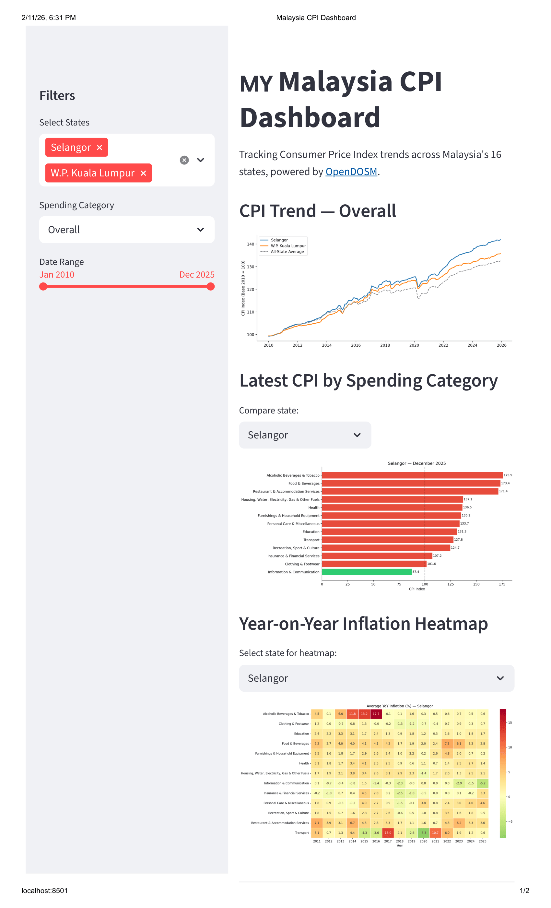

# Malaysia CPI Dashboard

An interactive Streamlit dashboard tracking Consumer Price Index (CPI) trends 
across Malaysia's 16 states, powered by official open data from the Department 
of Statistics Malaysia (DOSM).

## Features
- Live data ingestion from OpenDOSM API
- State-by-state CPI comparison across 13 spending categories
- Inflation trend analysis over time
- Interactive filtering by state, category, and date range

## Data Source
- **Provider:** Department of Statistics Malaysia (DOSM)
- **Portal:** [OpenDOSM](https://open.dosm.gov.my)
- **License:** Creative Commons Attribution 4.0 (CC BY 4.0)
- **Datasets:**
  - Monthly CPI by State & Division (2-digit)
  - Monthly CPI Inflation by State & Division (2-digit)

## Tools
Python, pandas, Streamlit, matplotlib, seaborn

## How to Run
1. Clone: `git clone https://github.com/YOUR_USERNAME/malaysia-cpi-dashboard.git`
2. Install: `pip install -r requirements.txt`
3. Run: `streamlit run src/app.py`

## Screenshots
